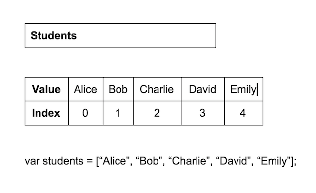

## lesson: 02 

<!-- ### topics outstanding -->

<!-- - loops 
- data types (arrays / objects)
- High-Order functions

- jQuery?
- DOM manipulation / events
- review functions / this / scope

- protoypes 
- classes
- recursion

- single threaded / callback 
- promises
- async / await
- fetch
- timers -->


<!-- ### if we have time -->

<!-- - variable scoping (private / public | global namespace)
- hoisting (where you declare variables/ functions)
- this / new
- fetch -->

### what we have covered

- developer tools (inspector)
- functions
- control flow (if-else)
- Math.random / Math.ceil

---

### what we will cover today

- loops (for loop)
- arrays
- objects (if we have time)
---

### Basic Loop

```
for (variable declaration; condition; variable increment) {
  // some code
}
```

---

### Example

```
for (var i = 0; i < 5; i++) {
  console.log('Printing number '+ i);
}
```
---

### challenge

- write a `for loop` that prints numbers 1-10
- write a `for loop` that prints even or odd number

---
### for loop 1-10

// console.log() 1 to 10
```
for (var i = 1; i <= 10; i++) {
  // code here
}
```
---

### for loop 1-10 (answer)

```
for (var counter = 1; counter <= 10; counter++) {
  // code here
  console.log(counter);
}
```
---
### for loop even/odd

```
for (var i = 1; i <= 10; i++) {
  // code here
  // remember to use the % (modulus symbol)
}
```
---


### for loop 1 to 100

```
for (var i = 1; i <= 100; i++) {
  // code here
  console.log(i); 
}
```

---
1. for 
2. initialize some var (as counter);
3. find condition before entering loop
4. execute code inside for loop
5. add counter

---


 ### for loop even/odd

```
for (var i = 1; i <= 10; i++) {
  // code here
  if (i % 2 == 0) {
    // print out even
  } else {    
    // print out odd
  }
}
```
---
### review

- loops (counting 0 -> 10)  
- loops (counting 0 -> 100)  
- loops (counting 0 -> 15)  
- loops (odd and even)  
- loops (assignment) : counting backwards (decrement);

---
### break time
---

### Data Types (Arrays)

  

> arrays are like boxes where we can store an unlimited amount of data
---

#### array addressing (index)

```
var refugeek = ['Abu', 'Warren', 'Sam'];

refugeek[0] // 'Abu'
refugeek[1] // 'Warren'
refugeek[2] // 'Sam'

...old way
refugeek1 = 'Abu';
refugeek2 = 'Warren';
... etc etc

arr.length // returns 3; ...3 elements are in the array
```
---
```


```
---

#### array methods 

```
.slice    // shallow copy array

.unshift  // add new element to start of array
.shift    // get first element and mutate array

.push     // add new element to end of array
.pop      // get last element and mutate array

.indexOf  // find index of array with content
.splice   // remove parts of an array
```
---
### slice
---
#### .slice()

```
var arr = ['bread', 'cheese'];
var copy = arr.slice();

console.log(copy);  // ['bread', 'cheese'];
```
---
#### .slice(startIndex, endIndex)
```
var arr = ['bread', 'cheese', 'fruit', 'milk'];
var copy = arr.slice(1,3);

console.log(copy) // ['cheese', 'fruit']
```

---
### push and pop

---
### push
```
.push     // add new element to end of array
```
---
### push (example)
```
var colors = ["red", "orange", "yellow"];
colors.push("green"); 

// ["red", "orange", "yellow", "green"]
```
---

### pop
```
.pop      // get last element and mutate array
```
---
### pop example
```
var colors = ["red", "orange", "yellow"];
colors.pop(); //["red", "orange"]

// pop() returns the removed element
var col = colors.pop(); // orange
```
---
### shift and unshift
---
### unshift
```
.unshift  // add new element to start of array
```
---
### unshift (example)
```
var colors = ["red", "orange", "yellow"];
colors.unshift("infrared");
console.log(colors);
// ["infrared", "red", "orange", "yellow"]
```
---
### shift
```
.shift    // get first element and mutate array
```
---

### shift (example)
```
var colors = ["red", "orange", "yellow"];
colors.shift(); // "red"

// shift() returns the removed element
console.log(colors) // ["orange", "yellow"];
```
---
### .indexOf

```
.indexOf   // find index of array with content
```
---
### .indexOf (example)
```
var friends = ["Charlie", "Liz", "David", "Mattias", "Liz"];
//returns the first index 
// at which a given element can be found

friends.indexOf("David");  // 2
friends.indexOf("Liz");    // 1, not 4

//returns -1 if the element is not present.
friends.indexOf("Hagrid"); //-1
```
---

### .splice

```
.splice(startIndex, howMany)  // remove parts of an array
```
---
### .splice (example)
```
var fruits = ['Banana', 'Orange', 'Lemon', 'Apple', 'Mango'];

// use splice to remove 'Orange' from the array
// specify index of the element to be removed and
// how many elements should be removed from that index

fruits.splice(1, 1); // returns: ["Orange"]

console.log(fruits); // prints: ["Banana", "Lemon", "Apple", "Mango"]
```
---

### array methods overview
```
.slice    // shallow copy array

.unshift  // add new element to start of array
.shift    // get first element and mutate array

.push     // add new element to end of array
.pop      // get last element and mutate array

.indexOf  // find index of array with content
.splice   // remove parts of an array
```
---
### array

### challenge

- create an array with some data (e.g. height)

```
var heights = [];

// heights
// [172, 123, 167]
// use heights.push(???);

console.log(heights);
```
---
### challenge (answer)

```
var heights = [];
height[0] = 175   // 175
height[1] = 123   // 123
height[2] = 165   // 165
console.log(heights);  // [175, 123, 165]
```
---
### challenge (without index);

```
var animals = [???, ???, ???];
console.log(animals); // ['elephant', 'chicken', 'cow']

```
---

### iterating over an array

1. for loop (array.length);
2. forEach
3. map

Note: we can skip this...
---


### Array.forEach / Array.map

- find max and min within array

### challenge 

---

### Data Types (Objects)

an object is a dictionary / hashtable

an object can store any standard data, including arrays and other objects
```
var myObj = {
    str: 'Hello',
    none: undefined,
    num: 54.3,
    bool: true
};

console.log(myObj["str"]);  // prints Hello
console.log(myObj["none"]); // prints undefined
console.log(myObj["num"]);  // prints 54.3
console.log(myObj["bool"]); // prints true
```

---
### when to use arrays over objects

arrays have natural orders (0,1,2...)  
objects have a key/name that you want to use as an index to store a collection of items  

---

### objects - extra

```
var fruit1 = {};

fruit1['name']  = 'Apple';
fruit1['qty']   = 2;
fruit1['value'] = 1;

fruit1.name === fruit1['name']  // 'Apple' 

// note: if there is a space in the key, 
//   dot-notation may not be appropriate
```

### challenge
```
var fruit1 = {
  name: 'Apple',
  value: 1,
  qty:   2
};

var fruit2 = {
  name: 'Banana',
  value: 2,
  qty:   5
};
```

